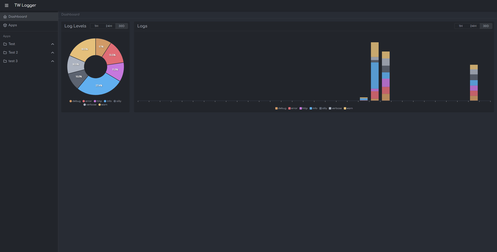
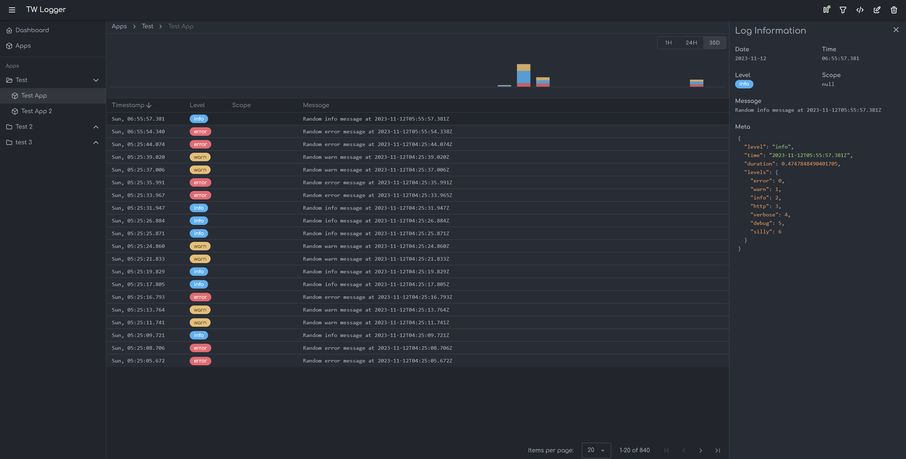
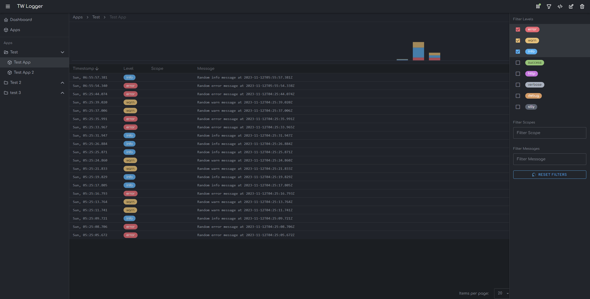

# LogTowa Frontend

<!-- #region badges -->
[](https://sq.srv.tobiaswaelde.com/dashboard?id=tobiaswaelde_cloud-logger-frontend_AYs6866NPhYnLbS8eM8p)
[](https://sq.srv.tobiaswaelde.com/dashboard?id=tobiaswaelde_cloud-logger-frontend_AYs6866NPhYnLbS8eM8p)
[](https://sq.srv.tobiaswaelde.com/dashboard?id=tobiaswaelde_cloud-logger-frontend_AYs6866NPhYnLbS8eM8p)
[](https://sq.srv.tobiaswaelde.com/dashboard?id=tobiaswaelde_cloud-logger-frontend_AYs6866NPhYnLbS8eM8p)
[](https://sq.srv.tobiaswaelde.com/dashboard?id=tobiaswaelde_cloud-logger-frontend_AYs6866NPhYnLbS8eM8p)
[](https://sq.srv.tobiaswaelde.com/dashboard?id=tobiaswaelde_cloud-logger-frontend_AYs6866NPhYnLbS8eM8p)
<!-- #endregion -->

This is the frontend of LogTowa.

### Dashboard


### Logs + Details


### Logs Filter


## Installation
```yml
# docker-compose.yml
version: '3.9'

services:
  logtowa-app:
    container_name: logtowa-app
    image: tobiaswaelde/logtowa-app:latest
    restart: always
    ports:
      - '3000:3000'
    environment:
      APP_TITLE: LogTowa # optional
      API_BASE_URL: http://localhost:3001
      API_TOKEN: secret
      SOCKET_TOKEN: secret
```

## Environment
| Variable     | Description                               | Required | Default Value |
| ------------ | ----------------------------------------- | -------- | ------------- |
| APP_TITLE    | Custom app title.                         | no       | LogTowa       |
| API_BASE_URL | The API URL.                              | yes      |               |
| API_TOKEN    | Token to authenticate API requests.       | yes      |               |
| SOCKET_TOKEN | Token to authenticate socket connections. | yes      |               |